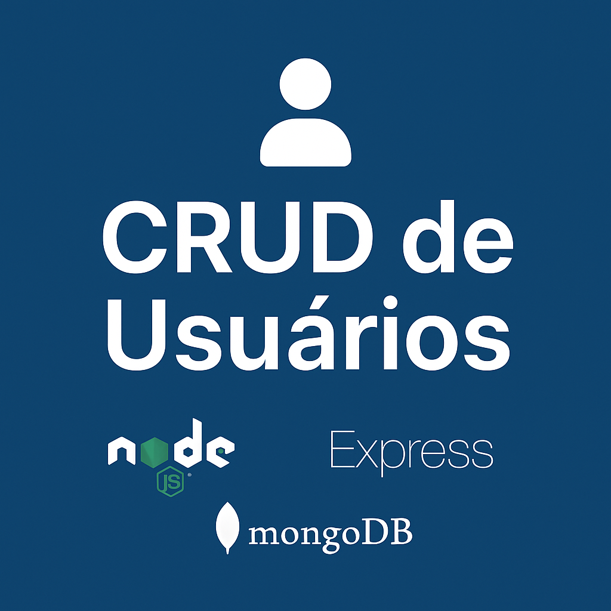

<p align="center">
  
</p>

<h1 align="center">👤 CRUD de Usuários</h1>

<p align="center">
  Projeto em <strong>Node.js + Express + MongoDB</strong> que implementa um CRUD (Create, Read, Update, Delete) de usuários.  
  Conectado ao <strong>MongoDB Atlas</strong> e testado com <strong>Thunder Client</strong>.
</p>

---

## 🚀 Tecnologias Utilizadas

- [Node.js](https://nodejs.org/)
- [Express.js](https://expressjs.com/)
- [MongoDB Atlas](https://www.mongodb.com/cloud/atlas)
- [Mongoose](https://mongoosejs.com/)
- [Dotenv](https://www.npmjs.com/package/dotenv)
- [CORS](https://www.npmjs.com/package/cors)
- [Nodemon](https://www.npmjs.com/package/nodemon) (desenvolvimento)
- [Thunder Client](https://www.thunderclient.com/) ou Postman (testes de API)

---

## 📦 Como Rodar o Projeto Localmente

```bash
# 1. Clone o repositório
git clone https://github.com/Marcusdba/crud-usuarios.git

# 2. Entre no diretório do projeto
cd crud-usuarios

# 3. Instale as dependências
npm install

# 4. Crie o arquivo .env na raiz do projeto
PORT=5000
MONGO_URI=sua_string_de_conexao_do_mongodb_atlas

# 5. Inicie o servidor (modo dev com nodemon)
npm run dev
